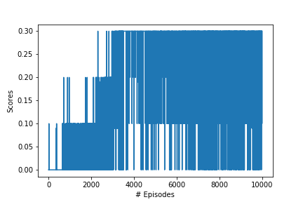

# Project 3 : Collaboration and Competition

## Project's goal

In this environment, two agents control rackets to bounce a ball over a net. If an agent hits the ball over the net, it receives a reward of +0.1.  If an agent lets a ball hit the ground or hits the ball out of bounds, it receives a reward of -0.01.  **Thus, the goal of each agent is to keep the ball in play.**

The task is episodic, and in order to solve the environment, **the agents must get an average score of +0.5 (over 100 consecutive episodes, after taking the maximum over both agents)**. Specifically,

- After each episode, we add up the rewards that each agent received (without discounting), to get a score for each agent. This yields 2 (potentially different) scores. We then take the maximum of these 2 scores.
- This yields a single **score** for each episode.

The environment is considered solved, when the average (over 100 episodes) of those **scores is at least +0.5.**

## Environment details

The environment is based on [Unity ML-agents](https://github.com/Unity-Technologies/ml-agents). The project environment provided by Udacity is similar to the [Tennis](https://github.com/Unity-Technologies/ml-agents/blob/master/docs/Learning-Environment-Examples.md#tennis) environment on the Unity ML-Agents GitHub page.

> The Unity Machine Learning Agents Toolkit (ML-Agents) is an open-source Unity plugin that enables games and simulations to serve as environments for training intelligent agents. Agents can be trained using reinforcement learning, imitation learning, neuroevolution, or other machine learning methods through a simple-to-use Python API. 

The observation space consists of 8 variables corresponding to the position and velocity of the ball and racket. Each agent receives its own, local observation.  Two continuous actions are available, corresponding to movement toward (or away from) the net, and jumping. 

- Set-up: Two-player game where agents control rackets to bounce ball over a net.
- Goal: The agents must bounce ball between one another while not dropping or sending ball out of bounds.
- Agents: The environment contains two agent linked to a single Brain named TennisBrain. After training you can attach another Brain named MyBrain to one of the agent to play against your trained model.
- Agent Reward Function (independent):
  - +0.1 To agent when hitting ball over net.
  - -0.1 To agent who let ball hit their ground, or hit ball out of bounds.
- Brains: One Brain with the following observation/action space.
- Vector Observation space: 8 variables corresponding to position and velocity of ball and racket.
  - In the Udacity provided environment, 3 observations are stacked (8 *3 = 24 variables) 
- Vector Action space: (Continuous) Size of 2, corresponding to movement toward net or away from net, and jumping.
- Visual Observations: None.
- Reset Parameters: One, corresponding to size of ball.
- Benchmark Mean Reward: 2.5

# Learning Algorithm
In my implementation I have chosen to an *off-policy method* called **Multi Agent Deep Deterministic Policy Gradient (MADDPG)** algorithm. I tried to use **Deep Deterministic Policy Gradient (DDPG)** to solve the problem, but it stops to converge at 0.3. 

- **DDPG**: The DDPG - Deep deterministic policy gradients - is a model free, off-policy actor-critic algorithm that uses deep neural networks to learn policies in high-dimensional, continuous action spaces. The actor network takes state as input and returns the action whereas the critic network takes state and action as input and returns the value. The critic in this case is a DQN with local and fixed target networks and replay buffer (memory). Both, actor and critic use two neural networks: local and fixed. The local networks are trained by sampling experiences from replay buffer and minimising the loss function.

For fixed number of timesteps in an episode, it will:
    Choose an action for the given state (step 1 and step 2)
    Take action and receive next state, reward, done (whether episode finished?)
    Store the current state, action, next state, reward and done as experience tuple in memory buffer (step 3)
    Sample random batch of experience (i.e length of memory > batch size, step 4)
    Train Actor and Critic networks using sampled minibatch

The following image from the paper shows the algorithm:

I tried to use DDPG to solve the problem. However, I stuck at 0.3. Check `solution_ddpg_testing.ipynb`.

- **MADDPG**: The key improvement of MADDPG over the DDPG approach is that we now share the actions taken by all agents to train each agent. This means that during the training, the Critics networks have access to the states and actions information of both agents, while the Actors networks have only access to the information corresponding to their local agent.

The following image from the paper shows the algorithm:

I managed to use solve the problem in 2323 episodes. 

### Hyperparameters
#### MADDPG

  | Hyperparameter                      | Value |
  | ----------------------------------- | ----- |
  | Replay buffer size                  | 1e5   |
  | Batch size                          | 200   |
  | Gamma                               | 0.995 |
  | Tau                                 | 1e-3  |
  | Learning rate of actor              | 1e-4  |
  | Learning rate of critic             | 5e-3  |
  | Actor_fc1_unit                      | 400   |
  | Actor_fc2_unit                      | 300   |
  | Critic_fcs1_unit                    | 400   |
  | Critic_fc2_unit                     | 300   |
  | Add_ou_noise                        | True  |
  | Mu_ou                               | 0     |
  | Theta_ou                            | 0.15  |
  | Sigma_ou                            | 0.1   |
  | Number of episodes                  | 10000 |
  | Max number of timesteps per episode | 1000  |

## Results
| MADDPG                                             | DDPG                                  |
| -------------------------------------------------- | ------------------------------------------------|
|     | 

## Ideas for improvement
I found online other people were managed to solve the problem using DDPG method, which takes longer and is less stable. I would like to spend more time investigating on how they have done it. 
