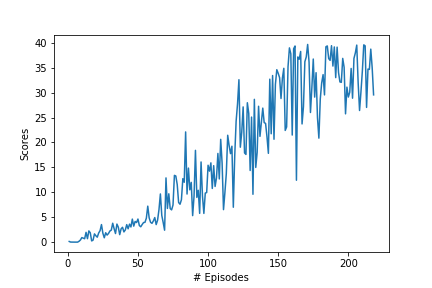

# Project 2 : Reacher Project (Continuous Control)

## Project's goal

In this environment, a double-jointed arm can move to target locations. A reward of +0.1 is provided for each step that the agent's hand is in the goal location. Thus, **the goal of the agent is to maintain its position at the target location for as many time steps as possible.**

## Environment details

The environment is based on [Unity ML-agents](https://github.com/Unity-Technologies/ml-agents). The project environment provided by Udacity is similar to the [Reacher](https://github.com/Unity-Technologies/ml-agents/blob/master/docs/Learning-Environment-Examples.md#reacher) environment on the Unity ML-Agents GitHub page.

> The Unity Machine Learning Agents Toolkit (ML-Agents) is an open-source Unity plugin that enables games and simulations to serve as environments for training intelligent agents. Agents can be trained using reinforcement learning, imitation learning, neuroevolution, or other machine learning methods through a simple-to-use Python API. 

The observation space consists of 33 variables corresponding to position, rotation, velocity, and angular velocities of the arm. Each action is a vector with four numbers, corresponding to torque applicable to two joints. Every entry in the action vector should be a number between -1 and 1.

- Set-up: Double-jointed arm which can move to target locations.
- Goal: The agents must move it's hand to the goal location, and keep it there.
- Agents: The Unity environment contains 10 agent linked to a single Brain.
  - The provided Udacity agent versions are Single Agent or 20-Agents
- Agent Reward Function (independent):
  - +0.1 Each step agent's hand is in goal location.
- Brains: One Brain with the following observation/action space.
  - Vector Observation space: 26 variables corresponding to position, rotation, velocity, and angular velocities of the two arm Rigidbodies.
  - Vector Action space: (Continuous) Size of 4, corresponding to torque applicable to two joints.
  - Visual Observations: None.
- Reset Parameters: Two, corresponding to goal size, and goal movement speed.
- Benchmark Mean Reward: 30

**In my implementation I have chosen to solve both the First and Second version of the environment using the off-policy DDPG algorithm.** 

# Learning Algorithm
- **DDPG**: The DDPG - Deep deterministic policy gradients - is a model free, off-policy actor-critic algorithm that uses deep neural networks to learn policies in high-dimensional, continuous action spaces. The actor network takes state as input and returns the action whereas the critic network takes state and action as input and returns the value. The critic in this case is a DQN with local and fixed target networks and replay buffer (memory). Both, actor and critic use two neural networks: local and fixed. The local networks are trained by sampling experiences from replay buffer and minimising the loss function.

For fixed number of timesteps in an episode, it will:
    Choose an action for the given state (step 1 and step 2)
    Take action and receive next state, reward, done (whether episode finished?)
    Store the current state, action, next state, reward and done as experience tuple in memory buffer (step 3)
    Sample random batch of experience (i.e length of memory > batch size, step 4)
    Train Actor and Critic networks using sampled minibatch

The following image from the paper shows the algorithm:

Solutions for the First and Second version are both based on Udacity's sample solution DDPG-pendulum. The only main differences are adding Normalization layers to speed up training process. For the Second version,  Hyperparameters are different for the First and Second version, based on experiments and suggestions from online resouces. 

### Hyperparameters
#### First version

  | Hyperparameter                      | Value |
  | ----------------------------------- | ----- |
  | Replay buffer size                  | 1e5   |
  | Batch size                          | 128   |
  | Gamma                               | 0.99  |
  | Tau                                 | 1e-3  |
  | Learning rate of actor              | 2e-4  |
  | Learning rate of critic             | 2e-4  |
  | Actor_fc1_unit                      | 128   |
  | Actor_fc2_unit                      | 128   |
  | Critic_fcs1_unit                    | 128   |
  | Critic_fc2_unit                     | 128   |
  | Add_ou_noise                        | True  |
  | Mu_ou                               | 0     |
  | Theta_ou                            | 0.15  |
  | Sigma_ou                            | 0.1   |
  | Number of episodes                  | 1000  |
  | Max number of timesteps per episode | 1000  |

#### Second version

  | Hyperparameter                      | Value |
  | ----------------------------------- | ----- |
  | Replay buffer size                  | 1e6   |
  | Batch size                          | 1024  |
  | Gamma                               | 0.99  |
  | Tau                                 | 1e-3  |
  | Learning rate of actor              | 1e-4  |
  | Learning rate of critic             | 3e-4  |
  | Actor_fc1_unit                      | 256   |
  | Actor_fc2_unit                      | 128   |
  | Critic_fcs1_unit                    | 128   |
  | Critic_fc2_unit                     | 128   |
  | Add_ou_noise                        | True  |
  | Mu_ou                               | 0     |
  | Theta_ou                            | 0.15  |
  | Sigma_ou                            | 0.1   |
  | Number of episodes                  | 1000  |
  | Max number of timesteps per episode | 1000  |

## Results
| First version                                      | Second version                                  |
| -------------------------------------------------- | ------------------------------------------------|
|     | 

## Ideas for improvement
Many ideas of the tuning hyperparameters are from online discussions and suggestions. Some of them worked straight away, some of them seemed to work for others but not me. Need more experiment and theoritical research to understand the tuning strategy. 
