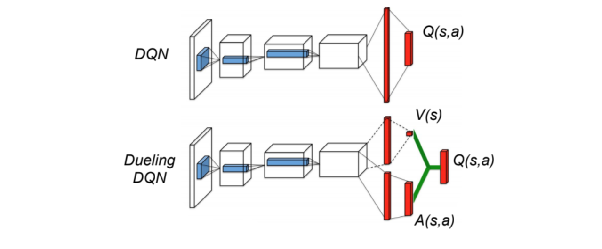
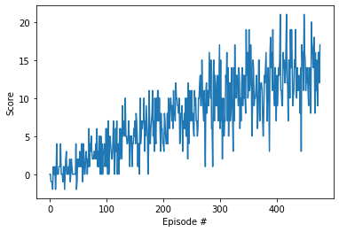
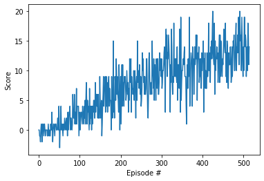

# Learning Algorithm
- **DQN**: An off-policy learning algorith. Q-learning is a form of Temporal-Difference learning (TD-learning), where unlike Monte-Carlo methods, we can learn from each step rather than waiting for an episode to complete. The idea is that once we take an action and are thrust into a new state, we use the current Q-value of that state as the estimate for future rewards.Deep Learning a neural network is used as function approximator. Two techniques contributed significantly towards stabilizing the training: Fixed Q-targets and Experience replay. 
The model architecture:

- **Double DQN**: Double DQN handles the problem of the overestimation of Q-values. Two networks are used to decouple the action selection from the target Q value generation. DQN network to select what is the best action to take for the next state (the action with the highest Q value). Target network to calculate the target Q value of taking that action at the next state.
The model architecture of Double DQN is the same as DQN. It uses two of them. 
- **Dueling Double DQN**: Dueling Double DQN separates the estimator of V(s) : the value of being at that state and A(s,a): the advantage of taking that action at that state (how much better is to take this action versus all other possible actions at that state). By decoupling the estimation, intuitively DDQN can learn which states are (or are not) valuable without having to learn the effect of each action at each state (since it’s also calculating V(s)). It helps accelerate the training. 
The model architecture:

### Hyperparameters

  There were many hyperparameters involved in the experiment. The value of each of them is given below:

  | Hyperparameter                      | Value |
  | ----------------------------------- | ----- |
  | Replay buffer size                  | 1e5   |
  | Batch size                          | 64    |
  | Gamma                               | 0.99  |
  | Tau                                 | 1e-3  |
  | Learning rate                       | 5e-4  |
  | update interval                     | 4     |
  | Number of episodes                  | 500   |
  | Max number of timesteps per episode | 2000  |
  | Epsilon start                       | 1.0   |
  | Epsilon minimum                     | 0.1   |
  | Epsilon decay                       | 0.995 |

## Results
| DQN                                        | Double DQN                         | Dueling DQN                                         |
| ------------------------------------------ | ---------------------------------- | --------------------------------------------------- |
|               |       |           |

## Ideas for improvement
Both Double DQN and Dueling Double DQN are supposed to accelerate the training, but from the results I got, DQN is still the fastest to converge. Need to dig deeper to get better understandings. 

